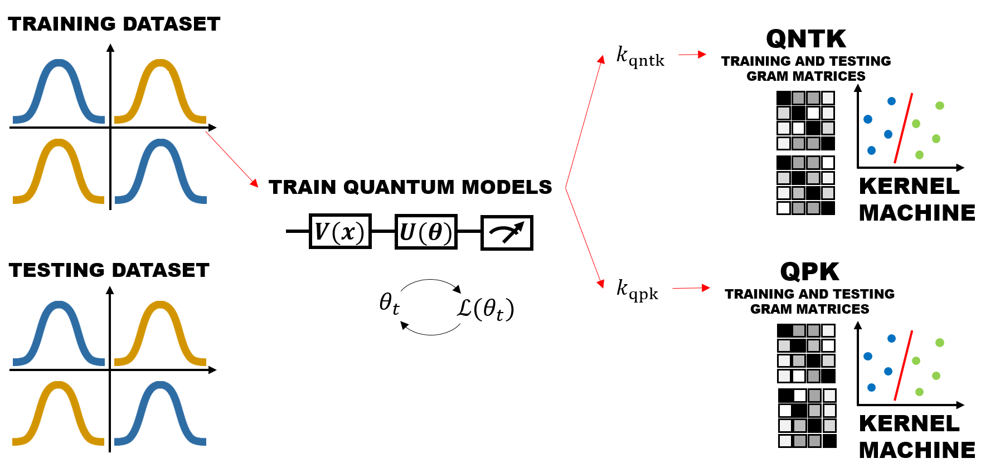

# The Quantum Path Kernel

This is the official implementation of [The Quantum Path Kernel](https://arxiv.org/abs/). 



The workflow that is used to evaluate the perfomances of the Quantum Path Kernel with respect
to the Quantum NTK is explained in details within the linked article. 

The only executable is ```quantum-path-kernel.py```, which is run with different
commands to generate the (training and testing) datasets, train and evaluate 
the models and generate the plots. The list of commands can be shown with:

    python3 quantum-path-kernel.py --help

while the detailed usage of each command can be shown with:

    python3 quantum-path-kernel.py <command> --help

## Requirements

The software requires to be run on Ubuntu 20.04 LTS and uses 
Python v3.9.11, PiP packet-manager v22.0.4 along with the other 
libraries listed in ```requirements.txt``` file in the root of 
the attached repository. To install requirements:

    python3 -m pip install -r requirements.txt

The code has been tested on these machines:

* one Dell Latitude 5510 having: Intel Core i7-10610U CPU with 4 physical cores, 16GB RAM, without CUDA-enabled GPUs
* one cluster node having: Intel Xeon Silver 4216 CPU with 64 physical cores, 180GB RAM, with 4 x CUDA-enabled GPUs NVidia Tesla V100S 32GB VRAM

Both devices have been running the configuration detailed above. 
_These experiments have not been run on quantum hardware._

The installation phase is straightforward on Ubuntu 20.04 LTS and won't require 
any further step.

_Note_: the JAX library, on operating systems different from Ubuntu, 
might require installation from source code. In alternative, the source code 
can be set such that PennyLane (the quantum circuit framework used) 
does not require JAX. In that case, the simulation of circuit might 
be much slower and won't benefit the full potential of multicore CPU and GPUs. 

## Training

A single experiments generate a single training dataset of the Gaussian XOR-like
Mixture problem, define several quantum machine learning models and train them 
according to the given specifications. This phase is started with the command:

    python3 quantum-path-kernel.py experiment --d <d> --snr <snr>  \
        --n <n> --loss <mse|bce> --layers <layers> --epochs <epochs> \
        [--directoryds <dirds>] [--skipto <skipto>] [--resume <resume>]

where:

* ```d``` (integer), ```snr``` (float), ```n``` (integer) are the specification for the training dataset generation as described in the following subsection;
* ```loss``` (string) is the loss function used during the training and can be set to either ```mse``` for meas quare error or ```bce``` for binary cross entropy;
* ```layers``` (integer) indicates how many quantum machine learning models you want to generate for this experiment, each one with an increasing number of layers up to the one specified by this parameter;
* ```epochs``` (integer) indicates for how many epochs you want to train each model;
* ```dirds``` (relative path) is used to use a previously generated training dataset as described in the following subsection;
* ```skipto``` (integer) indicates to skip the definition and training of first models up to the number specified;
* ```resume``` (relative path) instead of generating a new experiment, resume the one (previously interrupted due to e.g. errors) in the specified directory.

The optimizer used is ADAM using learning rate _0.1_. Each model is initialized using 
a parameter vector of the appropriate size i.i.d. sampled from a gaussian distribution 
of _\mu = 0, \sigma = 1_. 

For each model (having _L_ layers) a file ```spec<L>.json``` contains the specification of the experiments, i.e. the 
argument option you've passed within the command line. 

### Training dataset generation

The experiment phase randomly generates the training dataset using the given 
specifications:
* dimensionality of the feature vector _d_;
* noise _snr_;
* number of element in the training dataset _N_:
  * must be a multiple of 4 such that each of the 4 centroids are evenly represented.

Each of the models trained in a single experiment will be trained using the same
dataset generated at the beginning of the process. In alternative, 
the ```--directoryds``` option of ```experiment``` command allows to specify the 
directory of a previous experiment, containing a previously generated dataset. Such 
option is used to reproduce multiple times some experiments in order to estimate 
error bars. By using ```--directoryds``` option you still need to specify 
```--d```, ```--snr```, ```--n```, whose information will be used as sanity check. 

The specification of the training dataset and the training dataset itself is 
repeated identically within any```spec<L>.json``` file inside any experiment directory.

## Evaluation

For each experiment, the evaluation phase is started with the command:

    python3 quantum-path-kernel.py test --directory <direxperiment> \
        [--regenerate true|false] [--m <m>] [--directoryds <dirds>] \
        [--skipto <skipto>] [--skip <s>]

where:

* ```direxperiment``` (relative path) directory of the experiment we want to assess;
* ```r``` (string) "true" if we want to regenerate the testing dataset as detailed in the following subsection;
* ```m``` (integer) number of testing dataset points, default value 16;
* ```dirds``` (integer) directory of a pre-existing testing dataset, usage as detailed in the following subsection;
* ```skipto``` (integer) indicates to skip the testing of first models up to the number specified;
* ```skip``` (integer) indicates to skip the testing of model having the number of layers _s_, can be used multiple times.

### Testing dataset generation

The testing dataset is generated too, with the same specifications (_d_, _snr_) of the training dataset. Such information
if easily retrieved from the ```spec<L>.json``` file. The number _m_ of testing dataset point must be multiple of 4 in order
to have all centroids evenly represented. The testing dataset specifications (_m_) and the testing dataset itself is saved
within the ```spec<L>.json``` file. 

The ```--regenerate true``` option allows to erase any previously generated testing dataset and 
testing information, generates new one and restart the testing phase. 

In this configuration, in contrast with the training phase, each quantum machine learning model
within the same experiment is tested over a different randomly generated testing dataset, although
all having the same underlying specifications. If that's not the wanted behaviour (e.g. if you need to compare
different experiments with the same starting specification - error bar plot is an example for that) you
can specify ```--directoryds <dirds>``` option and the testing set for each model of the experiment will be the
previously generated testing set of the file ```spec01.json``` within the experiment in ```<dirds>```.

## Pre-trained models

Each experiment, for any of its quantum machine learning models, saves the value of the
parameters at each of the computational step. The file ```trace_<L>.pickle``` represents 
the training phase of the model having _L_ layers in a tabular form, each column composed
by: the epoch, the loss at such epoch, the parameter at such epoch. It is straightforward 
to instantiate the quantum model of _L_ layers using ```create_qnn``` which returns the 
function _y(x; θ)_ corresponding to the model, where _θ_ is the parameters of 
the model at some epoch of the training. 

The model _y(x; θ)_ can be used directly for classification. To implement the Quantum 
NTK and the Quantum Path Kernel the functions ```calculate_ntk``` and ```calculate_pk```
can be invoked. Since their calculation is quite expensive, the Gram matrix for the 
NTK at each epoch of the training is saved: for the Quantum NTK only the Gram matrix at the last
epoch of the training is needed, while for the Quantum Path Kernel we will use an average
of all them. The files ```ntk_grams_<L>.npy``` contains the list of NTK Gram matrices and 
```pk_gram_<L>.npy``` the (unique) Quantum Path Kernel matrix corresponding to the training 
dataset. The file ```ntk_test_grams_<L>.npy``` and ```pk_test_gram_<L>.npy``` contain the
same information related to the testing dataset. 

By loading the pre-calculated Gram matrices you can immediately replicate the results
by feeding them into a Support Vector Classifier.

_Note_: in order to load the ```pickle``` file you should use Pandas framework with the 
exact same version saved in ```requirements.txt```. Different version of Pandas may 
implement different version of the ```pickle``` file protocol, with results in the 
impossibility of reading such files. The same consideration applies to the binary 
format ```npy``` of NumPy arrays. 

## Results

The SVM model with the Quantum Path Kernel and Quantum NTK reaches the following 
performances.

Experiments having _d=4_, noise _snr = 0.1_, loss _BCE_:

| Model           | Accuracy SVM + QNTK | Accuracy SVM + QPK | Accuracy oracle |
|-----------------|---------------------|--------------------|-----------------|
| QNN (1 layers) | 0.50 | 0.50 | 1.00 |
| QNN (2 layers) | 0.67 | 0.50 | 1.00 |
| QNN (3 layers) | 0.96 | 0.58 | 1.00 |
| QNN (4 layers) | 0.83 | 0.75 | 1.00 |
| QNN (5 layers) | 0.77 | 0.67 | 1.00 |
| QNN (6 layers) | 0.83 | 0.71 | 1.00 |
| QNN (7 layers) | 0.65 | 0.73 | 1.00 |
| QNN (8 layers) | 0.73 | 0.69 | 1.00 |
| QNN (9 layers) | 0.81 | 0.79 | 1.00 |
| QNN (10 layers) | 0.75 | 0.77 | 1.00 |
| QNN (11 layers) | 0.85 | 0.83 | 1.00 |
| QNN (12 layers) | 0.81 | 0.79 | 1.00 |
| QNN (13 layers) | 0.71 | 0.96 | 1.00 |
| QNN (14 layers) | 0.60 | 0.83 | 1.00 |
| QNN (15 layers) | 0.75 | 0.92 | 1.00 |
| QNN (16 layers) | 0.73 | 0.83 | 1.00 |
| QNN (17 layers) | 0.75 | 0.90 | 1.00 |
| QNN (18 layers) | 0.75 | 0.92 | 1.00 |
| QNN (19 layers) | 0.81 | 0.88 | 1.00 |
| QNN (20 layers) | 0.67 | 0.92 | 1.00 |

Experiments having _d=4_, noise _snr = 0.4_, loss _BCE_:

| Model           | Accuracy SVM + QNTK | Accuracy SVM + QPK | Accuracy oracle |
|-----------------|---------------------|--------------------|-----------------|
| QNN (1 layers) | 0.44 | 0.40 | 1.00 |
| QNN (2 layers) | 0.58 | 0.56 | 1.00 |
| QNN (3 layers) | 0.56 | 0.58 | 1.00 |
| QNN (4 layers) | 0.62 | 0.75 | 1.00 |
| QNN (5 layers) | 0.73 | 0.71 | 1.00 |
| QNN (6 layers) | 0.73 | 0.67 | 1.00 |
| QNN (7 layers) | 0.71 | 0.79 | 1.00 |
| QNN (8 layers) | 0.67 | 0.75 | 1.00 |
| QNN (9 layers) | 0.69 | 0.71 | 1.00 |
| QNN (10 layers) | 0.60 | 0.77 | 1.00 |
| QNN (11 layers) | 0.67 | 0.73 | 1.00 |
| QNN (12 layers) | 0.67 | 0.73 | 1.00 |
| QNN (13 layers) | 0.71 | 0.73 | 1.00 |
| QNN (14 layers) | 0.67 | 0.75 | 1.00 |
| QNN (15 layers) | 0.65 | 0.73 | 1.00 |
| QNN (16 layers) | 0.75 | 0.83 | 1.00 |
| QNN (17 layers) | 0.62 | 0.75 | 1.00 |
| QNN (18 layers) | 0.73 | 0.75 | 1.00 |
| QNN (19 layers) | 0.67 | 0.77 | 1.00 |
| QNN (20 layers) | 0.73 | 0.77 | 1.00 |

Experiments having _d=4_, noise _snr = 1.0_, loss _BCE_:

| Model           | Accuracy SVM + QNTK | Accuracy SVM + QPK | Accuracy oracle |
|-----------------|---------------------|--------------------|-----------------|
| QNN (1 layers) | 0.44 | 0.44 | 0.56 |
| QNN (2 layers) | 0.38 | 0.44 | 0.56 |
| QNN (3 layers) | 0.52 | 0.52 | 0.62 |
| QNN (4 layers) | 0.46 | 0.54 | 0.56 |
| QNN (5 layers) | 0.50 | 0.50 | 0.56 |
| QNN (6 layers) | 0.48 | 0.54 | 0.56 |
| QNN (7 layers) | 0.58 | 0.54 | 0.52 |
| QNN (8 layers) | 0.44 | 0.52 | 0.60 |
| QNN (9 layers) | 0.44 | 0.54 | 0.60 |
| QNN (10 layers) | 0.52 | 0.58 | 0.60 |
| QNN (11 layers) | 0.56 | 0.52 | 0.58 |
| QNN (12 layers) | 0.54 | 0.56 | 0.62 |
| QNN (13 layers) | 0.54 | 0.52 | 0.58 |
| QNN (14 layers) | 0.54 | 0.58 | 0.54 |
| QNN (15 layers) | 0.48 | 0.46 | 0.58 |
| QNN (16 layers) | 0.52 | 0.52 | 0.56 |
| QNN (17 layers) | 0.52 | 0.48 | 0.56 |
| QNN (18 layers) | 0.54 | 0.48 | 0.58 |
| QNN (19 layers) | 0.48 | 0.52 | 0.54 |
| QNN (20 layers) | 0.52 | 0.52 | 0.56 |

Such information is better visualized using the plots generated as shown below. 

### Plot generation

To generate the plots related to a single experiment, which includes:

* plot of the training dataset;
* plot of the losses (of some or all models within the same experiment) with respect to the epochs of training;
* plot of the norm parameters change (of some or all models within the same experiment) with respect to the epochs of training;
* plot of the training accuracy (measures uniquely how precisely the training dataset is fitted);
* plot of the testing accuracy.

This can be done with the command:

    python3 quantum-path-kernel.py analyse --directory <direxperiment>

You can also generate an HTML document containing the report (recap of all experiments in the current folder) 
using the command:

    python3 quantum-path-kernel.py report [--refreshplot true|false]

where you can optionally re-generate the plots for all experiments.

If you need to generate the generalization error plots, which includes multiple (identical) experiments, 
in order to estimate the error bars you can use ```generalizationplot``` command. The only input is multiple
```--directory <direxperiment>``` options. A sanity check to confirm all experiments have identical specifications
is performed. The plots within the paper are generated with:

    python3.9 quantum-path-kernel.py generalizationplot --directory experiment_snr0.10_d4_lbce_202203261440 --directory experiment_snr0.10_d4_lbce_202204111213 --directory experiment_snr0.10_d4_lbce_202204111418 --output generalization_plot_snr010_d4_lossbce
    python3.9 quantum-path-kernel.py generalizationplot --directory experiment_snr0.40_d4_lbce_202203282128 --directory experiment_snr0.40_d4_lbce_202204111419 --directory experiment_snr0.40_d4_lbce_202204122056 --output generalization_plot_snr040_d4_lossbce
    python3.9 quantum-path-kernel.py generalizationplot --directory experiment_snr1.00_d4_lbce_202203261741 --directory experiment_snr1.00_d4_lbce_202204120830 --directory experiment_snr1.00_d4_lbce_202204130859 --output generalization_plot_snr100_d4_lossbce

for the generalization (testing) error, and:

    python3.9 quantum-path-kernel.py generalizationplot --training true --directory experiment_snr0.10_d4_lbce_202203261440 --directory experiment_snr0.10_d4_lbce_202204111213 --directory experiment_snr0.10_d4_lbce_202204111418 --output training_plot_snr010_d4_lossbce
    python3.9 quantum-path-kernel.py generalizationplot --training true --directory experiment_snr0.40_d4_lbce_202203282128 --directory experiment_snr0.40_d4_lbce_202204111419 --directory experiment_snr0.40_d4_lbce_202204122056 --output training_plot_snr040_d4_lossbce
    python3.9 quantum-path-kernel.py generalizationplot --training true --directory experiment_snr1.00_d4_lbce_202203261741 --directory experiment_snr1.00_d4_lbce_202204120830 --directory experiment_snr1.00_d4_lbce_202204130859 --output training_plot_snr100_d4_lossbce

for the training error. 

## Contributing

The Quantum Path Kernel © 2022 is licensed 
under [Attribution-NonCommercial-NoDerivatives 4.0 International](https://creativecommons.org/licenses/by-nc-nd/4.0/).
Please refer to the attached ```LICENSE``` file. 
